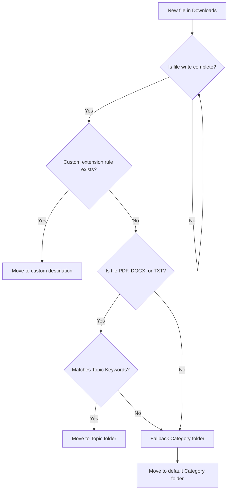

<p align="center">
  
  
  
  
</p>

<h1 align="center">Sortix</h1>
<p align="center"><strong>An intelligent, real-time downloads organizer and local file explorer.</strong></p>
<p align="center">Sortix runs silently in the background, monitors your Downloads directory, and automatically organizes incoming files into target folders based on file types, extension rules, or content-matching keywords.</p>

---

## Features

* **Active Patrol (Real-time monitoring):** Instantly detects new files landing in your Downloads directory and schedules organization once download completes (safely handles temporary files like `.crdownload` or `.part`).
* **Topic Classification (NLP Content Scanning):** Scans file names and document contents (supports PDF, DOCX, and TXT) for user-defined keywords (e.g., "Bank", "Gym", "University") to classify and file them into targeted directories.
* **Direct Extension Rules:** Simple rules mapping specific extensions directly to custom destinations (e.g., `.log` -> `Documents/Logs`).
* **Bilingual File Explorer Interface:** A clean, responsive Web UI featuring a dynamic directory tree, navigation breadcrumbs, and detailed execution logs in both English and Spanish.
* **Rich Theme System:** Toggle between fluid dark and light themes featuring hardware-accelerated circular transitions (utilizing the modern View Transitions API).
* **Cross-Platform Background Services:** Native setup scripts to easily install Sortix as a system service on Linux (systemd), macOS (LaunchAgents), or Windows (Task Scheduler).
* **Privacy-First & Self-Hosted:** Runs entirely locally on your machine with no external server requests, zero tracking, and no database exposure.

---

## How It Works

When a new file finishes downloading, it undergoes a prioritized organizational pipeline:



### Default Categorization Mapping

If no custom rules or topic keyword hits are found, files fall back to standard category mapping:

| Category | Target Folder (Relative to `~`) | Supported Extensions |
| :--- | :--- | :--- |
| **Images** | `Pictures/Downloads` | `jpg`, `jpeg`, `png`, `gif`, `webp`, `svg`, `raw`... |
| **Videos** | `Videos/Downloads` | `mp4`, `mkv`, `mov`, `avi`, `webm`, `flv`, `wmv`... |
| **Music** | `Music/Downloads` | `mp3`, `wav`, `flac`, `ogg`, `m4a`, `aac`, `wma`... |
| **Compressed** | `Downloads/Compressed` | `zip`, `rar`, `7z`, `tar`, `gz`, `tgz`, `bz2`... |
| **Installers** | `Downloads/Installers` | `exe`, `msi`, `deb`, `rpm`, `apk`, `dmg`, `pkg`... |
| **Documents** | `Documents/Other` | `pdf`, `doc`, `docx`, `odt`, `txt`, `xlsx`, `csv`... |
| **Other** | `Downloads/Other` | *Any extension not mapped above* |

---

## Quick Start

### Prerequisites
* Python 3.10 or higher.

### Manual Setup & Run

1. Clone this repository:
   ```bash
   git clone <your-repo-url>
   cd sortix
   ```
2. Initialize virtual environment and install dependencies:
   ```bash
   cd backend
   python3 -m venv .venv
   source .venv/bin/activate  # On Windows: .venv\Scripts\activate
   pip install -r requirements.txt
   ```
3. Start the application:
   ```bash
   python main.py
   ```
4. Open your browser and navigate to **http://127.0.0.1:5000** to toggle Active Patrol, view downloads, or customize rules.

*Optional configuration:* Copy `backend/.env.example` to `backend/.env` and edit `HOST`, `PORT`, or `DOWNLOADS_DIR` if you use a non-standard downloads path.

---

## Background Service Installation (Recommended)

To keep Sortix watching your Downloads directory continuously without keeping a terminal open, install it as a background service:

### Linux (systemd user service)
```bash
cd backend/deploy
./install_linux.sh
```
*Note: The service starts automatically with your user session. Run `sudo loginctl enable-linger $USER` to keep it running when your session is closed.*

### Windows (Scheduled Task)
Open PowerShell as Administrator and run:
```powershell
cd backend\deploy
powershell -ExecutionPolicy Bypass -File install_windows.ps1
```

### macOS (LaunchAgent)
```bash
cd backend/deploy
./install_macos.sh
```

*To remove the background service at any time, run the corresponding `./uninstall_...` script from the `deploy/` folder.*

---

## Configuration & Customization

* **Custom Categories:** Base categories, folder paths, and extension maps are customized by editing [backend/config/categories.json](backend/config/categories.json).
* **Custom Topics:** Topics (e.g. "Work", "Finances") are managed directly in the Web UI under Settings -> Topics.
* **Portability:** All folder paths resolved by Sortix are relative to the user's personal home directory (`~` / `C:\Users\username`), ensuring seamless compatibility and safety across different systems.

---

## License

This project is licensed under the MIT License.
